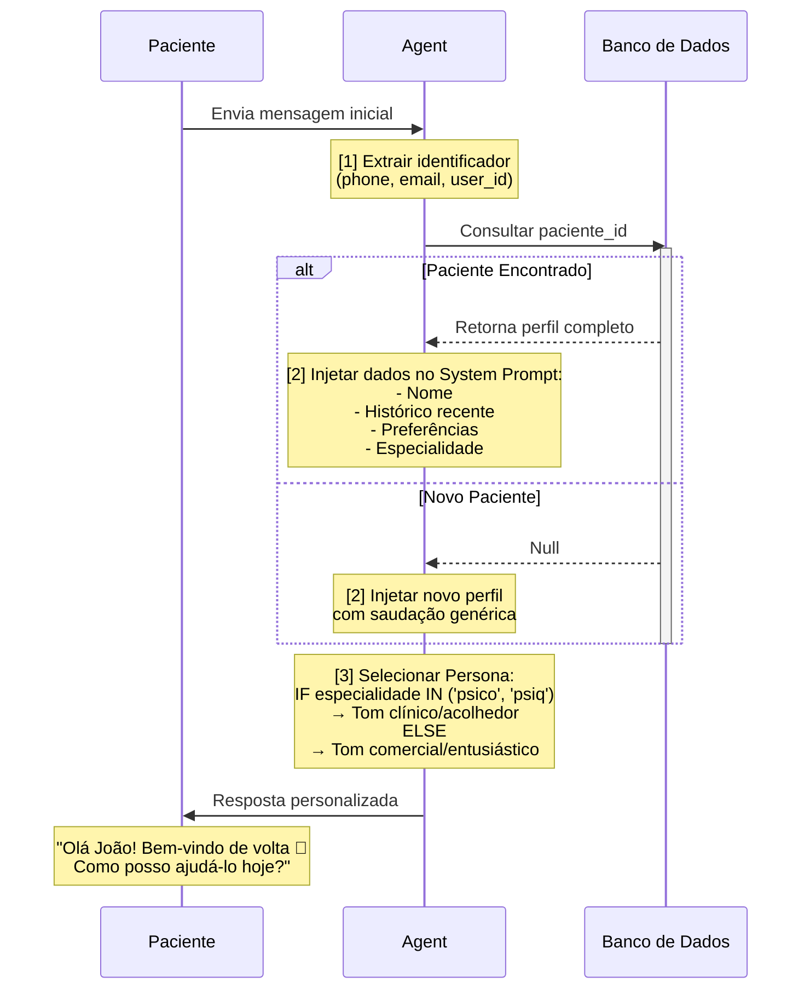
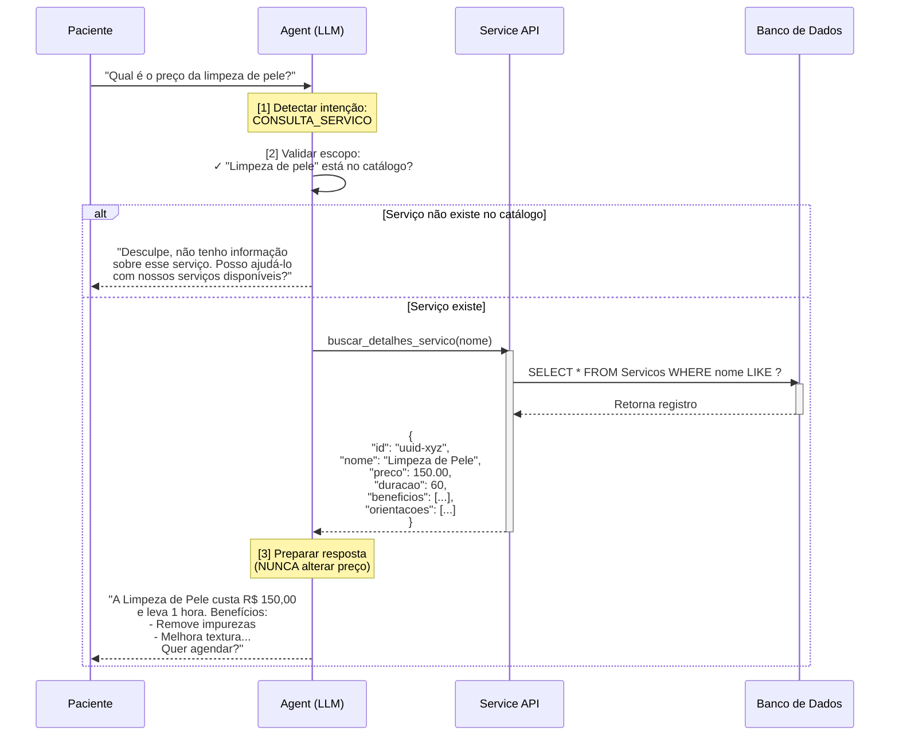
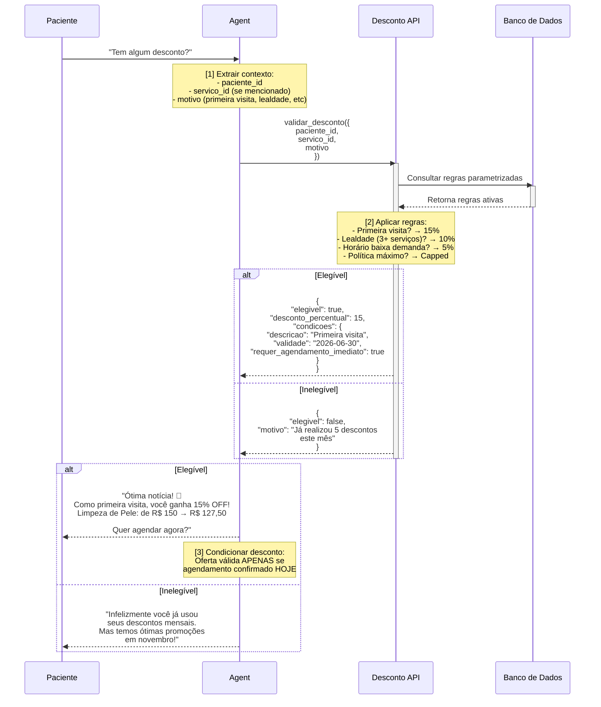
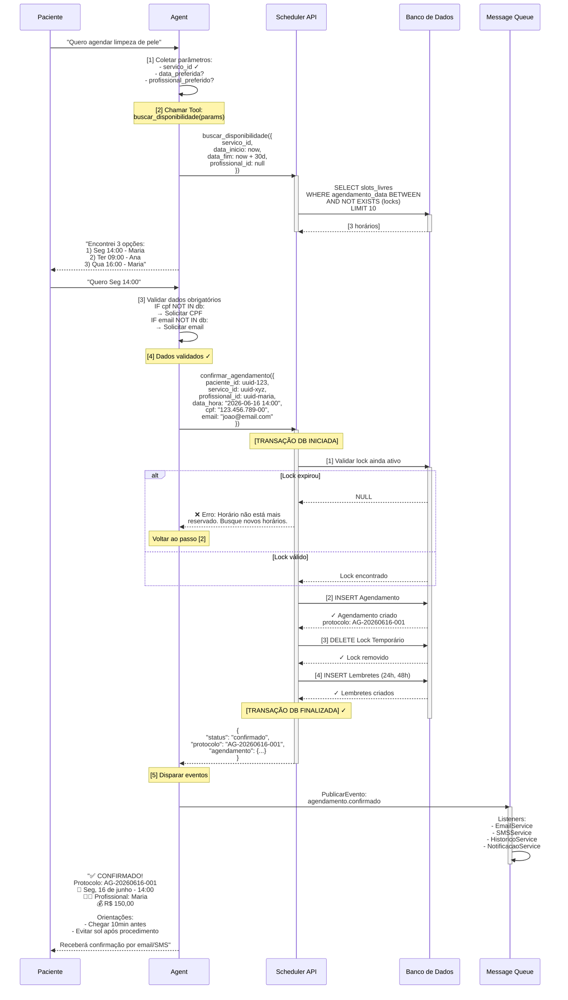
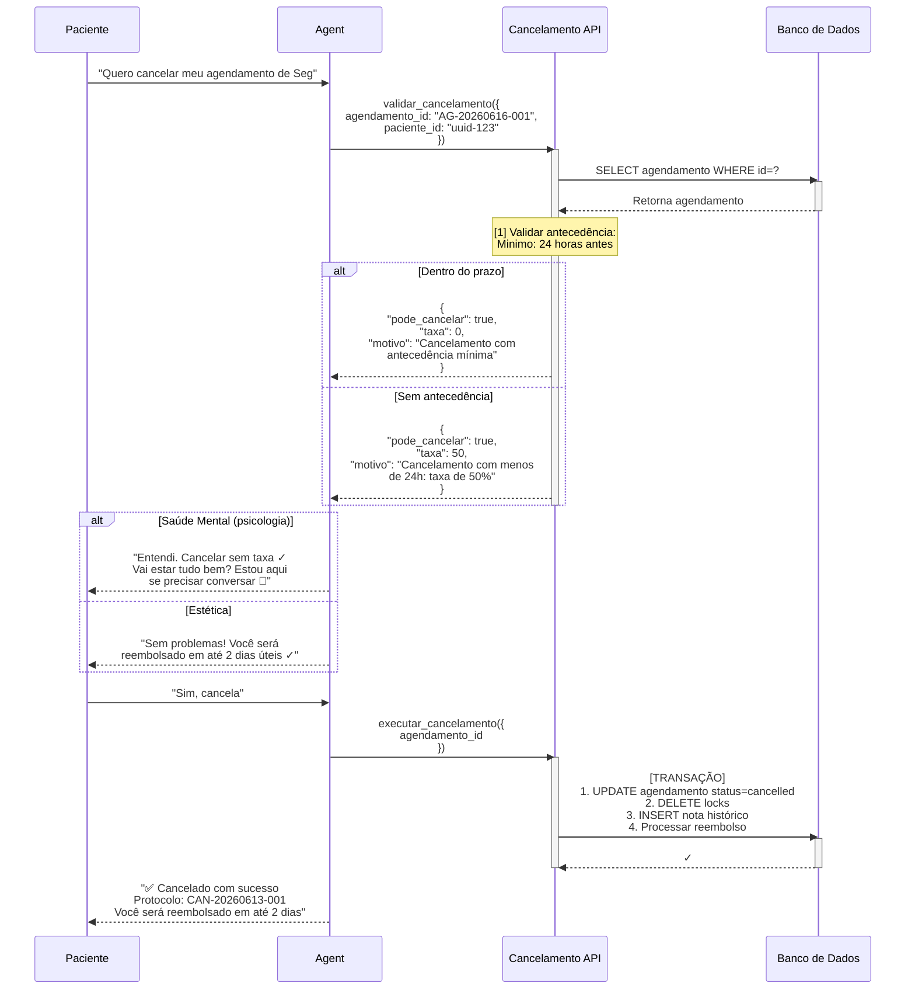
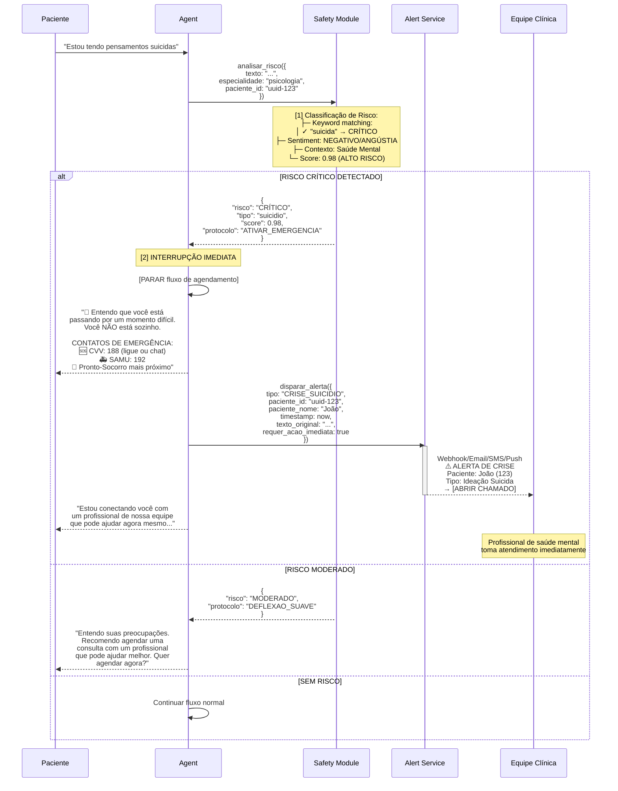

# 📊 FLUXOS PRINCIPAIS DO SISTEMA

## Índice Rápido

| # | Fluxo | RF | Status |
|---|-------|-----|--------|
| 1 | Acolhimento e Triagem | RF01-03 | Core |
| 2 | Base de Conhecimento (RAG) | RF04-06 | Core |
| 3 | Negociação e Descontos | RF07-08 | Core |
| 4 | Agendamento | RF09-12 | **Critical** |
| 5 | Self-Service | RF13-15 | Core |
| 6 | Handoff Inteligente | RF16-18 | Core |
| 7 | Detecção de Crise | RF19-20 | **Critical** |
| 8 | Confirmação Ativa | RF21-23 | Core |
| 9 | Fila de Espera | RF24-25 | Opcional |
| 10 | Cross-Selling | RF26-27 | Opcional |
| 11 | Cobrança | RF28-29 | Core |
| 12 | Multimodalidade | RF31-32 | Opcional |

---

## FLUXO 1️⃣: Acolhimento e Triagem (RF01-03)

### 🎯 Objetivo
Identificar o paciente, recuperar seu contexto e adaptar o comportamento do agente.

### 📝 Requisitos Funcionais
- **RF01**: Identificação de Usuário
- **RF02**: Injeção Dinâmica de Contexto
- **RF03**: Roteamento de Persona

### 🔄 Sequência Detalhada



### 💾 Dados Injetados no System Prompt

```json
{
  "sistema": {
    "data_atual": "2026-06-13",
    "especialidade": "estética",
    "persona": "comercial_entusiasta"
  },
  "paciente": {
    "id": "uuid-123",
    "nome": "João",
    "primeira_visita": false,
    "ultimo_agendamento": "2026-05-15",
    "ultimo_servico": "Limpeza de Pele",
    "historico_recente": [
      {
        "data": "2026-05-15",
        "servico": "Limpeza de Pele",
        "profissional": "Maria (Esteticista)",
        "comentario_paciente": "Amei! Voltei com a pele brilhando 😍"
      }
    ],
    "servicos_preferidos": ["Limpeza de Pele", "Hidratação"],
    "frequencia_estimada": "30 dias"
  },
  "restricoes": {
    "apenas_servicos_catalogados": true,
    "nunca_inventar_precos": true,
    "redirecionamento_medico_complexo": true
  }
}
```

### ✅ Critérios de Sucesso
- ✅ Paciente se sente reconhecido
- ✅ Tone of voice correto para especialidade
- ✅ Contexto do histórico está injetado

---

## FLUXO 2️⃣: Base de Conhecimento (RAG) (RF04-06)

### 🎯 Objetivo
Fornecer informações precisas sobre serviços, procedimentos, preços e benefícios.

### 📝 Requisitos Funcionais
- **RF04**: Consulta de Catálogo (RAG/API)
- **RF05**: Recuperação Dinâmica de Preços
- **RF06**: Limite de Escopo (Safety Filter)

### 🔄 Sequência



### 🛡️ Safety Filters

| Filter | Ação |
|--------|------|
| **Serviço não existe** | Sugerir alternativas do catálogo |
| **Paciente pede preço "normal"** | Retornar SEMPRE da API/BD |
| **Consulta médica complexa** | "Você deve consultar o médico" |
| **Pergunta sobre diagnóstico** | Redirecionar para profissional |

### 💾 Estrutura do Serviço (Catálogo)

```json
{
  "id": "uuid-estética-001",
  "nome": "Limpeza de Pele",
  "descricao": "Procedimento de higienização profunda da pele",
  "categoria": "estética",
  "duracao_minutos": 60,
  "preco_base": 150.00,
  "beneficios": [
    "Remove impurezas",
    "Melhora textura",
    "Prepara para outros procedimentos"
  ],
  "orientacoes": {
    "pre": "Nenhuma preparação necessária",
    "pos": "Evitar sol por 48h"
  },
  "contraindicacoes": [
    "Pele muito sensível inflamada"
  ],
  "profissionais_habilitados": ["uuid-maria", "uuid-ana"],
  "ativo": true
}
```

---

## FLUXO 3️⃣: Negociação e Descontos (RF07-08)

### 🎯 Objetivo
Ofertar descontos de forma controlada e estratégica.

### 📝 Requisitos Funcionais
- **RF07**: Validação de Elegibilidade
- **RF08**: Condicionalidade de Conversão

### 🔄 Sequência



### 📋 Regras de Desconto (Parametrizadas)

```json
{
  "regras_desconto": [
    {
      "id": "primeira_visita",
      "nome": "Primeira Visita",
      "condicoes": {
        "primeira_visita": true,
        "especialidades": ["estética", "salão"]
      },
      "desconto_percentual": 15,
      "desconto_fixo": null,
      "validade_dias": 30,
      "usos_por_paciente": 1,
      "requer_agendamento_imediato": true
    },
    {
      "id": "lealdade_3_servicos",
      "nome": "Lealdade (3+ Serviços)",
      "condicoes": {
        "total_servicos_realizados": { "gte": 3 },
        "dias_desde_ultimo": { "gte": 30 }
      },
      "desconto_percentual": 10,
      "usos_por_paciente": null,
      "requer_agendamento_imediato": false
    },
    {
      "id": "horario_baixa_demanda",
      "nome": "Horário de Baixa Demanda",
      "condicoes": {
        "hora_inicio": { "gte": "10:00", "lte": "12:00" },
        "dia_semana": ["terça", "quarta"],
        "ocupacao_agenda": { "lte": 30 }
      },
      "desconto_percentual": 5,
      "validade_minutos": 10
    }
  ],
  "politicas": {
    "desconto_maximo_acumulado": 25,
    "limite_descontos_mes": 5
  }
}
```

---

## FLUXO 4️⃣: Agendamento (RF09-12) ⭐ **CRITICAL**

### 🎯 Objetivo
Core business: Reservar horários com garantia de não double-booking.

### 📝 Requisitos Funcionais
- **RF09**: Consulta Parametrizada de Horários
- **RF10**: Sistema de Lock (Bloqueio Temporário)
- **RF11**: Validação e Coleta de Dados
- **RF12**: Efetivação Transacional

### 🔄 Sequência Completa



### 🔐 Lock Temporário

```json
{
  "id": "lock-temp-001",
  "agendamento_id": null,
  "paciente_id": "uuid-123",
  "profissional_id": "uuid-maria",
  "data_hora": "2026-06-16 14:00:00",
  "servico_id": "uuid-estética-001",
  "criado_em": "2026-06-13 15:30:00",
  "expira_em": "2026-06-13 15:35:00",
  "ttl_segundos": 300
}
```

### ✅ Validações Antes de Commit

| Validação | Erro |
|-----------|------|
| Lock ainda válido | "Horário não está mais disponível" |
| Dados obrigatórios completos | "Faltam dados (CPF, email)" |
| Paciente não tem 3+ agendamentos naquele dia | "Limite de agendamentos excedido" |
| Serviço não tem contraindicações | "Você não pode fazer este serviço" |

---

## FLUXO 5️⃣: Self-Service (RF13-15)

### 🎯 Objetivo
Permitir que pacientes gerenciem seus próprios agendamentos.

### 📝 Requisitos Funcionais
- **RF13**: Resumo de Agendamentos
- **RF14**: Liberação de Slot
- **RF15**: Validação de Regra de Cancelamento

### 🔄 Resumo de Agendamentos

```
PACIENTE: "Quais são meus agendamentos?"
    ↓
AGENT: Consulta BD → Lista futuros + histórico recente
    ↓
Próximos:
  1) Seg 16/jun - 14:00 | Limpeza de Pele (Maria) | R$ 150 | [CANCELAR]
  2) Seg 23/jun - 10:00 | Hidratação (Ana) | R$ 120 | [CANCELAR]

Histórico:
  ✓ Dom 15/jun - Limpeza de Pele (Maria) | Realizado
  ✓ Dom 08/jun - Hidratação (Ana) | Realizado
```

### 🔄 Cancelamento



---

## FLUXO 6️⃣: Handoff Inteligente (RF16-18)

### 🎯 Objetivo
Transição suave para atendimento humano quando necessário.

### 📝 Requisitos Funcionais
- **RF16**: Deflexão Suave
- **RF17**: Fallback (Beco sem Saída)
- **RF18**: Geração de Dossiê

### 🔄 Sequência

```
PACIENTE: "Quero falar com um atendente"
    ↓
[1] Tentativa de Deflexão Suave:
    "Claro! Antes, posso te ajudar com
     algo específico? Por exemplo:
     - Agendar um horário?
     - Cancelar alguma coisa?
     - Dúvida sobre preços?"
    
    P: "Não, só quero falar com atendente"
    
[2] Validar Motivo:
    - Solicitação explícita? ✓ SIM
    - Ou ciclo infinito (5+ iterações)? ❌ NÃO
    → Proceder ao Handoff

[3] Gerar Dossiê:
    {
      "protocolo_chat": "CHAT-20260613-001",
      "paciente_id": "uuid-123",
      "paciente_nome": "João",
      "email": "joao@email.com",
      "telefone": "+5511999999999",
      "historico_conversa": [
        { "timestamp": "...", "autor": "paciente", "texto": "..." },
        { "timestamp": "...", "autor": "agent", "texto": "..." }
      ],
      "resumo_inteligente": {
        "intencao_principal": "Agendamento de limpeza de pele",
        "status_conversacao": "Agendamento pendente de confirmação",
        "dados_coletados": {
          "servico": "Limpeza de Pele",
          "profissional_preferido": "Maria",
          "data_preferida": "2026-06-16 14:00"
        },
        "proximos_passos": [
          "Coletar CPF",
          "Confirmar email",
          "Processar pagamento (desconto 15% aplicável)"
        ],
        "sentimento_paciente": "Positivo, engajado"
      }
    }

[4] Notificar Recepção:
    Dashboard da Recepção:
    
    🔔 NOVO CHAT PARA ATENDER
    ├─ Paciente: João (UUID-123)
    ├─ Telefone: +5511999999999
    ├─ Intenção: Agendamento
    ├─ Status: Parcialmente resolvido
    └─ [VER DOSSIÊ COMPLETO]

[5] Transferir para Atendente:
    A-->>P: "Vou conectar você com nossa
             recepção. Um momento..."
    
    P: Conectado com Atendente Humano ✓
```

---

## FLUXO 7️⃣: Detecção de Crise (RF19-20) ⭐ **CRITICAL**

### 🎯 Objetivo
Interceptar urgências médicas/psicológicas e ativar protocolo de emergência.

### 📝 Requisitos Funcionais
- **RF19**: Interceptação de Risco
- **RF20**: Protocolo de Emergência

### 🔄 Sequência



### 🚨 Gatilhos de Crise

| Gatilho | Tipo | Ação |
|---------|------|------|
| "suicida", "matar" | CRÍTICO | Emergência |
| "automutilação", "cortar" | CRÍTICO | Emergência |
| "desespero", "não aguento" | MODERADO | Escalação |
| Agressividade/abuso | CRÍTICO | Bloqueio + Alerta |
| Menção de arma/veneno | CRÍTICO | Emergência |

### 📞 Contatos de Emergência (Brasil)

```json
{
  "emergencia": {
    "samu": "192",
    "policia": "190",
    "corpo_de_bombeiros": "193"
  },
  "saude_mental": {
    "cvv_call": "188 (ligação gratuita)",
    "cvv_chat": "https://www.cvv.org.br/",
    "caps_servico_aberto": "24h em grandes cidades"
  }
}
```

---

## FLUXO 8️⃣: Confirmação Ativa (RF21-23)

### 🎯 Objetivo
Lembretes proativos para aumentar presença e reduzir no-shows.

### 📝 Requisitos Funcionais
- **RF21**: Disparo Proativo
- **RF22**: Interpretação de Intenção Ambígua
- **RF23**: Lembretes de Cuidados Prévios

### 🔄 Sequência (Worker/Cronjob)

```
[SCHEDULE: 48 horas antes de cada agendamento]

SELECT agendamentos WHERE
  data_hora = now() + 48h
  AND status = 'confirmado'
  AND lembrete_48h NOT SENT

FOR EACH agendamento:
  
  [1] Construir mensagem personalizada:
      "Olá João! 👋
       Lembrete: Seu agendamento de
       Limpeza de Pele está marcado para
       
       📅 Seg, 16 de junho às 14:00
       📍 Nossa clínica
       👩‍⚕️ Com Maria
       
       Orientações:
       ✓ Chegue 10 minutos antes
       ✓ Evite maquiagem
       ✓ Após: evitar sol por 48h
       
       Confirmar: Sim / Não / Reagendar?"
  
  [2] Enviar via SMS/WhatsApp/Email
  
  [3] Aguardar resposta do paciente
      (timeout: 48 horas)

[SCHEDULE: 24 horas antes]
  Repetir processo com mensagem diferente

[RESPONSE INTERPRETATION]
  
  IF paciente responde "Não vou poder":
    → LLM interpreta a intenção
    → Oferecer reagendamento
    → Liberar slot
  
  IF paciente responde "Sim, confirmado":
    → Atualizar status
    → Enviar orientações finais
  
  IF paciente não responde:
    → Considerar "silêncio = confirmação"
    → Enviar última lembrança 2h antes
```

---

## FLUXO 9️⃣: Fila de Espera (RF24-25)

### 🎯 Objetivo
Maximizar ocupação da agenda.

### 🔄 Resumo

```
PACIENTE: "Quero esse horário mas não está disponível"
    ↓
AGENT: "Podemos colocar você na fila de espera?
        Se alguém cancelar, você é o primeiro
        a ser notificado!"
    ↓
PACIENTE: "Sim, coloca!"
    ↓
[INSERT Waitlist Entry]
    ↓
[WAIT for cancellation]
    ↓
[CANCELLATION detected]
    ↓
[AUTO-MATCH: Check waitlist for this slot]
    ↓
[ACTIVE NOTIFICATION]
    AGENT: "João! Ótima notícia! 🎉
            O horário de Seg 14:00 ficou
            disponível. Quer confirmar?"
    ↓
[IF sim: Proceder ao agendamento]
[IF não: Manter na fila]
```

---

## FLUXO 🔟: Cross-Selling (RF26-27)

### 🎯 Objetivo
Aumentar ticket médio com sugestões inteligentes.

### 🔄 Resumo

```
[APÓS AGENDAMENTO PRINCIPAL]

AGENT: "João, vi que é sua primeira
        hidratação. Posso sugerir?
        
        💡 Limpeza de Pele + Hidratação
        no mesmo dia = melhor resultado!
        
        Profissional: Maria (especialista)
        Próximo horário: Seg 15:30 (1h depois)
        Desconto combo: 20% OFF no segundo"

[IF interessado]
  → Buscar novo horário
  → Aplicar regra de combo
  → Confirmar duplo agendamento

[IF não interessado]
  → Sugerir complemento menor
  → Ex: "Creme pós-procedimento?"
```

---

## FLUXO 1️⃣1️⃣: Cobrança (RF28-29)

### 🎯 Objetivo
Integração segura com payment gateway.

### 🔄 Sequência

```
[AGENDAMENTO CONFIRMADO]
    ↓
[1] Gerar Link de Pagamento
    - Serviço: Limpeza de Pele
    - Valor: R$ 127,50 (com desconto)
    - Link PIX/Cartão: [https://...]
    - Validade: 24 horas
    
[2] Enviar ao Paciente
    "Para garantir seu horário,
     realize o pagamento de sinal:
     
     💳 PIX (copia e cola):
     00020126580014br.gov.bcb.pix...
     
     🔗 Ou clique aqui: [link]
     
     ⏰ Válido por 24 horas"

[3] Aguardar Webhook do Payment Gateway
    └─ Stripe/MercadoPago/etc envia
       webhook: payment.completed
    
[4] Callback Handler
    payment_id: "...",
    status: "completed",
    timestamp: "..."
    
    → UPDATE agendamento
      SET status = 'pagamento_confirmado'
    
    → Enviar confirmação final

[5] Pós-Pagamento
    "✅ Pagamento recebido!
     Seu agendamento está 100% garantido.
     Será um prazer atendê-lo! 😊"
```

---

## FLUXO 1️⃣2️⃣: Multimodalidade (RF31-32)

### 🎯 Objetivo
Suportar imagens e documentos.

### 🔄 Sequência

```
PACIENTE: [Envia foto de acne no rosto]
    ↓
AGENT: [Recebe imagem]
    ↓
[1] Validação:
    - Formato válido? ✓
    - Tamanho < 10MB? ✓
    - NSFW check? ✓
    
[2] Análise:
    - Armazenar em Cloud Storage
    - Extrair metadados
    - Descrição: "Imagem de acne moderada
                  em região frontal"
    
[3] Resposta:
    "Entendi! Pela imagem vejo que
     é acne moderada. Recomendo:
     
     1. Limpeza de Pele Profunda (R$ 150)
     2. Peeling Químico (R$ 180)
     3. Sessão com dermatologista (R$ 250)
     
     Quer saber mais sobre alguma opção?"

[4] Documentos (Formulários)
    AGENT: "Preciso que você preencha
            nossa ficha de anamnese.
            
            📄 Clique aqui para download"
    
    PACIENTE: [Clica, preenche, retorna]
    
    → Armazenar no dossiê do paciente
    → Notificar profissional
```

---

## 🎯 Resumo de Fluxos Críticos

| Fluxo | Criticidade | Tempo Real | Transacional |
|-------|-------------|-----------|----------------|
| Agendamento | 🔴 CRÍTICO | Sim | Sim (ACID) |
| Detecção de Crise | 🔴 CRÍTICO | Sim | Não |
| Cancelamento | 🟠 ALTO | Sim | Sim |
| Confirmação Ativa | 🟡 MÉDIO | Não (Async) | Não |
| Cross-Selling | 🟢 BAIXO | Sim | Não |

**Próximo**: Consulte [REGRAS_NEGOCIO.md](./REGRAS_NEGOCIO.md) para detalhes das regras parametrizadas.
